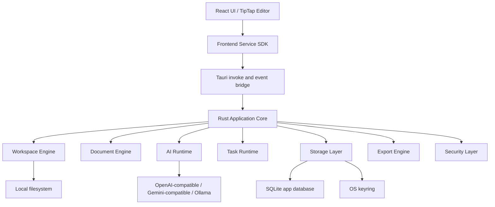

# Tauri Native-first Productization Design

## Goal

Transform Lumina Edit Pro from a browser-first React Markdown editor into a native-first desktop AI Markdown workspace powered by Tauri v2. The target product experience is a local-first tool similar in spirit to Codex App: workspace-centered, persistent, inspectable, recoverable, and safe by default.

## Product Direction

Lumina Edit Pro should become a desktop productivity tool for long-form Markdown writing, project documentation, knowledge-base editing, and AI-assisted authoring.

The product should combine:

- Typora-like writing and Markdown editing ergonomics.
- Obsidian-like local workspace ownership.
- Codex App-like AI task execution, logs, reviewable file changes, and resumable sessions.

The desktop application should not be a thin wrapper around the existing browser app. The React frontend remains the UI layer, while Tauri/Rust becomes the application backend for filesystem access, persistence, AI requests, task execution, and system integration.

## Architecture

## Frontend Responsibilities

The frontend is responsible for presentation and interaction only:

- Rendering the editor, file tree, outline, AI panel, task panel, settings, and diff review UI.
- Managing transient UI state such as modal visibility, selected text, pending input, and editor focus.
- Calling typed service APIs from `src/services`.
- Subscribing to backend events for streaming AI output, task logs, file changes, and save status.

The frontend must not directly perform native-sensitive work:

- No direct `fetch` to AI providers in desktop mode.
- No direct persistence of API keys.
- No direct arbitrary filesystem access.
- No direct database access from components.
- No direct `invoke(...)` calls from UI components.

## Rust Backend Responsibilities

The Tauri/Rust backend is responsible for native application behavior:

- Workspace open, restore, scan, search, file watch, and access validation.
- Markdown document read/write, autosave, snapshots, and atomic writes.
- SQLite persistence for settings, sessions, templates, memory, tasks, and metadata.
- Secure API key storage through the OS keyring.
- AI provider requests, streaming, abort, retry, and normalized errors.
- AI task runtime with steps, logs, status, and generated file changes.
- Reviewable file operations and diff generation before applying AI edits.
- Export jobs for HTML, PDF, DOCX, and future formats.
- Tauri security capabilities, permissions, CSP, and system integration.

## Core Modules

### Workspace Engine

The workspace engine manages local project directories.

Responsibilities:

- Open a user-selected directory through the native dialog.
- Assign each workspace a stable ID.
- Persist recently opened workspaces.
- Scan Markdown files and asset directories.
- Watch for external file changes.
- Resolve all file operations relative to the workspace root.
- Reject path traversal and workspace escape attempts.
- Provide a normalized file tree to the frontend.
- Maintain searchable metadata for workspace files.

Representative backend commands:

- `workspace_open`
- `workspace_recent`
- `workspace_restore`
- `workspace_list_entries`
- `workspace_read_file`
- `workspace_write_file`
- `workspace_create_file`
- `workspace_create_directory`
- `workspace_rename_entry`
- `workspace_delete_entry`
- `workspace_search`

### Document Engine

The document engine owns document content, save behavior, snapshots, and AI edit application.

Responsibilities:

- Read Markdown files with UTF-8 first and GBK fallback.
- Write files atomically by writing to a temporary sibling file and replacing the target.
- Keep autosave independent from React lifecycle quirks.
- Create snapshots for manual saves, autosaves, and AI edits.
- Compute text diffs for AI-generated changes.
- Apply accepted changes only after user review.
- Track dirty/saved/error state for each open document.

Representative backend commands:

- `document_open`
- `document_save`
- `document_snapshot_create`
- `document_snapshot_list`
- `document_snapshot_restore`
- `document_diff`
- `document_apply_change`

### AI Runtime

The AI runtime replaces browser-side provider requests.

Responsibilities:

- Store provider metadata in SQLite.
- Store provider API keys in the OS keyring.
- List models through backend HTTP requests.
- Send chat completion requests through Rust.
- Support streaming deltas through Tauri events.
- Support cancellation through task IDs.
- Normalize provider errors into stable frontend error types.
- Build context from selected text, current document, workspace search, history, memory, and templates.
- Support OpenAI-compatible providers first, then add Gemini-compatible and local providers.

Representative backend commands and events:

- `ai_provider_list`
- `ai_provider_save`
- `ai_provider_delete`
- `ai_model_list`
- `ai_chat_start`
- `ai_chat_abort`
- Event: `ai://delta`
- Event: `ai://completed`
- Event: `ai://failed`

### Task Runtime

The task runtime provides the Codex App-like execution experience.

Responsibilities:

- Represent AI work as durable tasks instead of one-off frontend requests.
- Persist task status, input, steps, logs, result, and generated changes.
- Support queued, running, paused, completed, failed, and cancelled states.
- Allow task resume after application restart when the task has enough saved context.
- Expose logs and generated artifacts to the UI.
- Keep generated file changes separate from applied workspace files until user approval.

Representative backend commands and events:

- `task_create`
- `task_start`
- `task_abort`
- `task_retry`
- `task_list`
- `task_get`
- `task_apply_change`
- Event: `task://status`
- Event: `task://log`
- Event: `task://artifact`

### Storage Layer

SQLite is the source of truth for local application metadata.

Stored in SQLite:

- Application settings.
- Workspaces and recent files.
- AI provider metadata excluding secret keys.
- Model cache.
- Templates.
- Chat sessions and messages.
- Memory summaries and user-defined memory.
- Document snapshots.
- AI tasks, task steps, logs, and generated changes.
- Workspace index metadata.

Stored in OS keyring:

- Provider API keys.

Stored in the workspace filesystem:

- User Markdown files.
- Assets.
- Export outputs when the user chooses a workspace path.

### Export Engine

The export engine should move export workflows from ad hoc frontend behavior to controlled backend jobs.

Initial formats:

- HTML.
- PDF through a controlled rendering/print pipeline.

Follow-up formats:

- DOCX.
- Static site bundle.

Exports should be task-backed so the UI can show progress, output path, errors, and retry actions.

## Frontend Service SDK

All Tauri calls are isolated under `src/services`.

Recommended service groups:

- `src/services/native`: environment detection, invoke wrapper, event subscription.
- `src/services/workspace`: workspace and file tree operations.
- `src/services/documents`: open, save, snapshot, diff, and apply operations.
- `src/services/ai`: providers, models, chat, streaming, and abort.
- `src/services/tasks`: durable task lifecycle and logs.
- `src/services/settings`: application settings.

UI components call services, not Tauri APIs directly.

## Data Safety

Filesystem operations must follow these rules:

- The backend maps `workspace_id` to an absolute root path.
- Frontend requests use workspace IDs and relative paths.
- The backend canonicalizes paths before every read or write.
- The canonicalized target must stay inside the workspace root.
- Writes are atomic.
- Deletes use explicit user confirmation in the frontend.
- AI-generated changes are stored separately and only applied after review.

Secrets must follow these rules:

- API keys are never stored in `localStorage`.
- API keys are never embedded into the frontend bundle.
- API keys are stored in the OS keyring.
- Logs must redact API keys and authorization headers.

## Existing Code Migration

The following existing files are priority migration targets:

- `src/lib/fileSystem.ts`: replace browser File System Access API usage with workspace services in desktop mode.
- `src/lib/workspacePersistence.ts`: replace IndexedDB file handles with backend workspace records.
- `src/contexts/AIContext.tsx`: move persistent AI state to SQLite-backed services.
- `src/lib/ai/openaiClient.ts`: replace browser `fetch` with backend AI runtime calls.
- `src/App.tsx`: reduce orchestration responsibilities by moving feature behavior into service-backed modules.
- `vite.config.ts`: remove frontend API key injection during desktop productization.

## Implementation Phases

### Phase 1: Native Shell and Core Skeleton

Add Tauri v2, establish Rust module boundaries, add SQLite initialization, add a typed frontend service SDK, and keep the current UI running inside the desktop window.

### Phase 2: Native Workspace

Move workspace open, file tree, file read/write, image asset writes, and autosave to Rust-backed services.

### Phase 3: Native Storage

Move settings, AI templates, memory, chat history, recent workspaces, and document snapshots from browser storage to SQLite and keyring-backed storage.

### Phase 4: Backend AI Runtime

Move AI provider calls to Rust, support streaming events, abort, retry, model listing, error normalization, and secure API key access.

### Phase 5: Task and Diff Review

Introduce durable AI tasks, task logs, generated changes, diff preview, and explicit apply/reject workflows.

### Phase 6: Desktop Release

Add updater, file associations, native menus, shortcut integration, installer configuration, logging, crash diagnostics, and release packaging.

## Acceptance Criteria

The productization is successful when:

- The application can run as a Tauri desktop app.
- A user can open a local workspace, edit Markdown, insert images, autosave, close the app, reopen it, and recover the same workspace state.
- User settings, templates, chat history, memory, document snapshots, and task records persist through SQLite-backed storage.
- API keys are stored outside frontend storage.
- AI requests run through the Rust backend.
- Streaming, abort, retry, and normalized errors work from the UI.
- AI-generated document changes can be reviewed before being applied.
- Long-running AI work is represented as durable tasks with logs and status.
- Existing browser-focused behavior is either preserved behind a browser adapter or intentionally replaced by native behavior.
